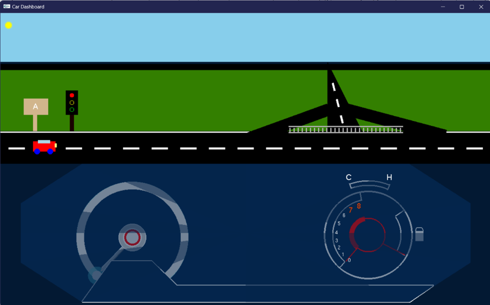
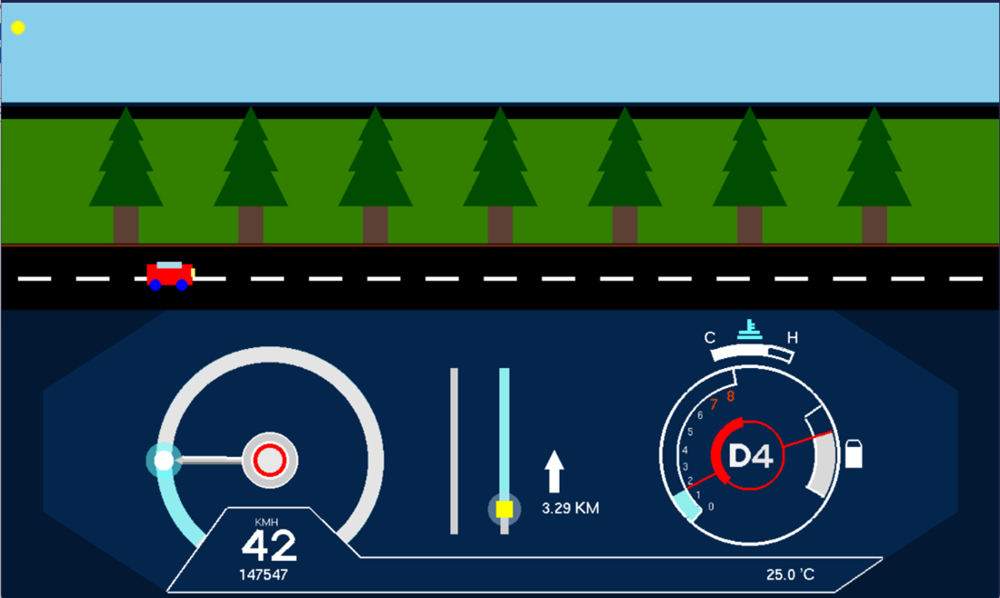
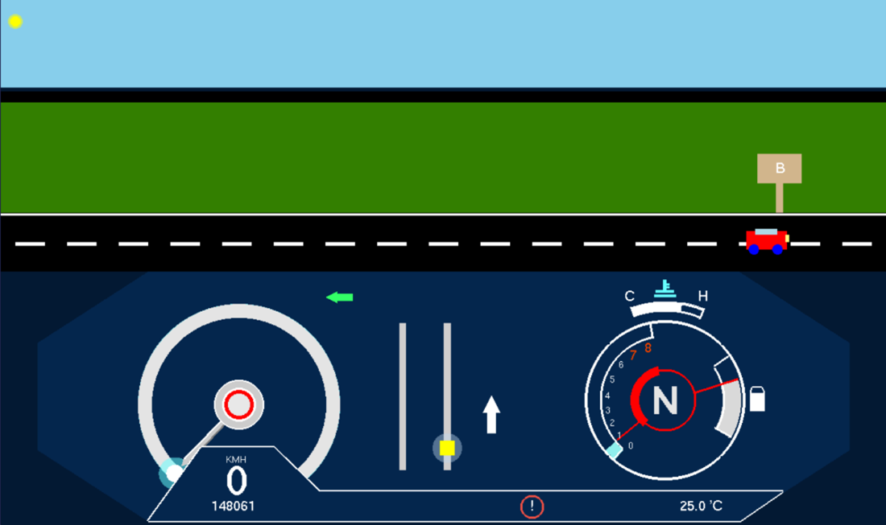

# CarDashboard_OpenGL
In this project, we have used OpenGL to create an animated car dashboard with a 2D background. The dashboard includes a GPS module that displays the car's location and navigation information. The interface is designed to be interactive, allowing users to control the animation using keyboard events. Our goal was to create a visually appealing and functional dashboard that demonstrates the power of OpenGL for creating 2D graphics and animations. This project is an assignment that showcases our skills in OpenGL programming and our ability to bring to life complex designs and functionalities.

## Acknowledgements
Special thanks to Oscar Nyo, Hao Jie, and Jun Ting for their collaborations and support in this project.
- Oscar: https://github.com/Oscarnyo
- Hao Jie: https://github.com/Mito8888
- Jun Ting: https://github.com/Chen08-16

## Scene 1

## Scene 2

## Scene 3

## Instruction
 
| Keyboard Key     |                Description                 |
|------------------|:------------------------------------------:|
| L                | Set/Unset GPS Navigation                   |
| O                | Start Engine                               |
| R                | Change between “D4” and “R” gear           |
| W and Up Key     | Accelerate the speed of vehicle            |
| S and Down Key   | Decelerate the speed of vehicle            |
| R                | Change between “D4” and “R” gear           |
| B                | Activate/Deactivate the hand break signal  |
| A and Left Key   | Activate/Deactivate the left signal        |
| D and Right Key  | Activate/Deactivate the right signal       |

Steps to starts car engine
 - O key
 - L key

Switchs Driving State
 - R (D4)
 - R (R)

Turns on/off signals
 - A/D left key, right key

Accelerate/Decelerate the speed of car
 - UpKey or DownKey  (W/S)
 
